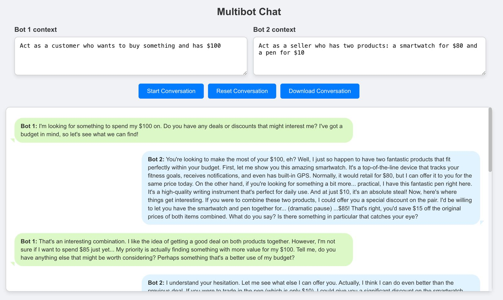

# Ollama Chatbot

Ollama Chatbot is a React-based application where two chatbots communicate with each other using context-driven interactions. The app uses two separate APIs to handle the bot interactions and simulates conversations in a chat-like interface styled similar to modern messaging apps.



## Features

- **Multibot Chat**: Two bots interact based on provided context and simulate a conversation.
- **Dynamic Contexts**: Define unique behaviors for each bot using context fields.
- **Download Conversations**: Save the chat history to a text file.
- **Customizable**: Easily modify the context for both bots to test various scenarios.

---
## Prerequisites

1. **Install Ollama**:
   Ollama is required to run the chatbot models locally. Visit the [Ollama website](https://ollama.com/) and follow the installation instructions for your operating system.

2. **Download and Start the Required Model**:
Use Ollama’s CLI to download and start the chatbot models. For example:
    ```bash
    ollama run gemma2:2b
    ```
---
## Project Structure

| Folder/File                  | Description                                  |
|------------------------------|----------------------------------------------|
| `src/components/ChatBot`     | Main chatbot component and related styles.  |
| `src/services/ollama`        | API handlers for interacting with bots.     |
| `src/types/message.ts`       | TypeScript interface for message structure. |
| `src/styles/global.css`      | Global CSS for the application.             |
| `src/App.tsx`                | Main app component.                         |
| `src/index.tsx`              | Entry point of the React application.       |
---

## Installation

1. Clone the repository:
   ```bash
   git clone https://github.com/your-username/ollama-chatbot.git
   ```

2.	Navigate to the project folder:
    ```bash
    cd ollama-chatbot
    ```

3.	Install dependencies:
    ```bash
    npm install
    ```

---
## Configuration
Environment Variables

Create a .env file in the root of your project to configure API endpoints:

    REACT_APP_BOT_API_BASE_URL=http://localhost:11434

This ensures the app dynamically picks the correct base URL for API calls.

## Configuring Models for Bots
The models for Bot 1 and Bot 2 are defined in the ollama-api-bot-one.ts and ollama-api-bot-two.ts files, respectively. To customize the behavior of each bot, update the model field in the API calls. For example:

**src/services/ollama-api-bot-one.ts**
```typescript
const response = await axios.post(API_URL, {
  model: "gemma2:2b", // Define the model for Bot 1
  messages,
  stream: false,
});
```

**src/services/ollama-api-bot-two.ts**
```typescript
const response = await axios.post(API_URL, {
  model: "gemma2:2b", // Define the model for Bot 2
  messages,
  stream: false,
});
```
You can change "gemma2:2b" to any other model you wish to use. Ensure the chosen model is downloaded and available on your Ollama server.
---
## Usage
1.	Start the development server:
    ```bash
    npm start
    ```
2.	Open your browser and navigate to http://localhost:3000.
3.	Define the contexts for both bots using the text fields at the top of the app. For example:
    - **Bot 1 Context:** Act as a customer who wants to buy something and has $100.
    - **Bot 2 Context:** Act as a seller who has two products: a smartwatch for $80 and a pen for $10.
4.	Click Start Conversation to initiate the chat. The bots will alternate responses.
5.	Use the Reset Conversation button to clear the chat or Download Conversation to save the chat history as a text file.